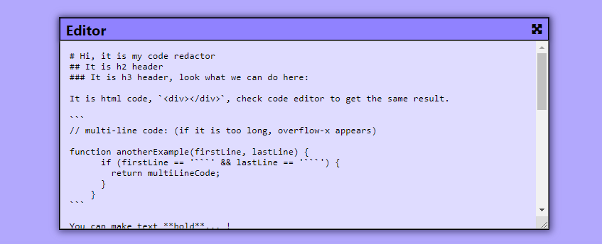
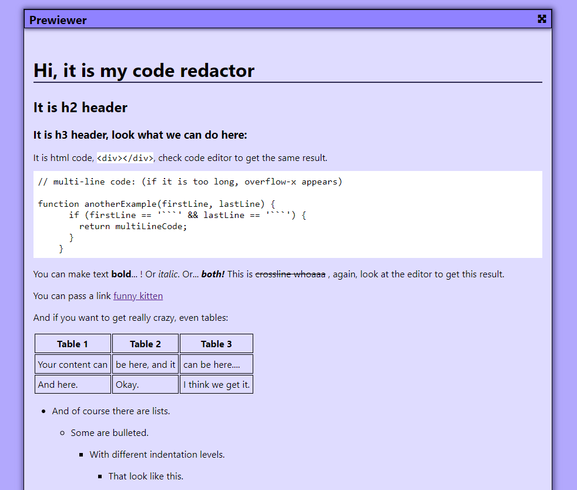

# Markdown code editor/ Markdown код редактор.
### Follow this link to see markdown app: / Перейдите по ссылке чтобы вопольсоваться редактором : [Markdown-Editor](https://gamza222.github.io/markdown-preview/)
## You write a markdown code imn the editor: / Вы пишите markdown код в редакторе:

## And its converts to html and appears in prewiver: / И ваш код конвертируется в html и показывается в окне предосмотра:

## You can look for markdown commands at the internet and try it/ вы можете найти команды markdown и попробовать их в действии
